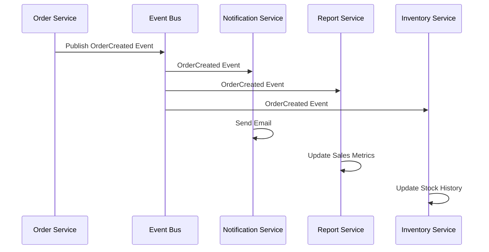
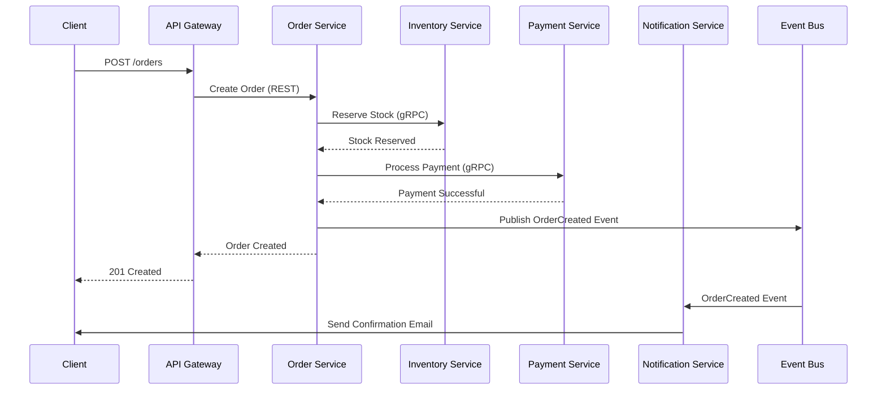
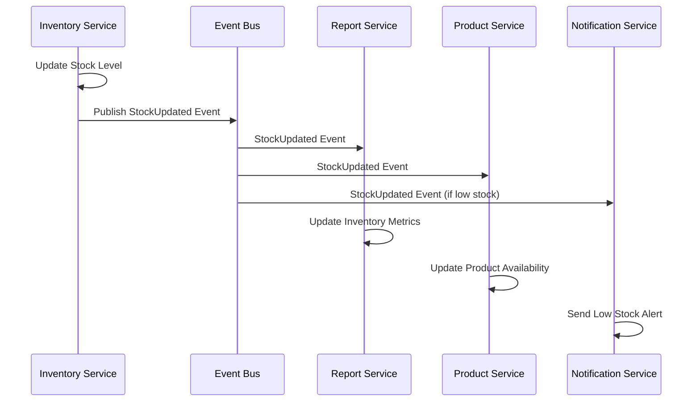
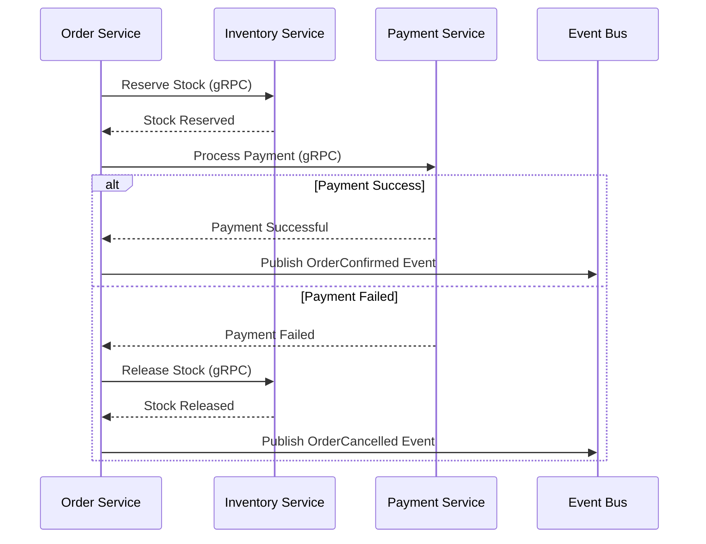
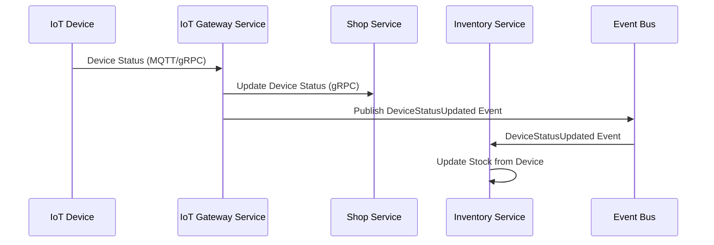

# Communication Patterns

This document describes the communication patterns used between microservices in the Retail ERP system.

## Overview

Microservices communicate using a combination of:
- **Synchronous communication** (REST, gRPC) for real-time operations
- **Asynchronous communication** (Events, Message Queues) for eventual consistency

## Communication Methods

### 1. REST API (Synchronous)

**When to Use:**
- Real-time operations requiring immediate response
- Simple request-response patterns
- External API integrations
- Client-to-service communication

**Use Cases:**
- Order → Inventory (stock check)
- Campaign → Product (get product info)
- API Gateway → Services (routing)

**Example:**
```javascript
// Order Service calling Inventory Service
const response = await axios.get(
  `http://inventory-service/api/inventory/${shopId}/${productId}`
);
```

**Pros:**
- Simple and familiar
- Easy to debug
- Works well with HTTP/HTTPS
- Good for external APIs

**Cons:**
- Tight coupling (service must be available)
- No built-in retry mechanism
- Can cause cascading failures

---

### 2. gRPC (Synchronous)

**When to Use:**
- High-performance inter-service communication
- Strong typing required
- Streaming data
- Internal service-to-service calls

**Use Cases:**
- Order → Inventory (reserve stock)
- Order → Payment (process payment)
- IoT Gateway → Shop Service (device status)
- vm-service → Shop Service (vending machine operations)

**Example:**
```javascript
// Order Service calling Inventory Service via gRPC
const client = new InventoryServiceClient('inventory-service:50051');
const response = await client.reserveStock({
  shopId: 'shop123',
  productId: 'prod456',
  quantity: 5
});
```

**Pros:**
- High performance (HTTP/2, binary protocol)
- Strong typing (Protocol Buffers)
- Streaming support
- Built-in retry and timeout

**Cons:**
- More complex than REST
- Requires code generation
- Less browser-friendly

**Current Implementation:**
- Already in use: vm-service ↔ Shop Service
- gRPC with mTLS for security

---

### 3. Event-Driven (Asynchronous)

**When to Use:**
- Eventual consistency is acceptable
- Decoupling services
- Multiple consumers needed
- Non-critical operations

**Use Cases:**
- Order created → Notification service
- Inventory updated → Report service
- Payment processed → Order service
- Device status → Shop service

**Event Flow Example:**


**Pros:**
- Loose coupling
- Scalability (multiple consumers)
- Resilience (service can be down)
- Event replay capability

**Cons:**
- Eventual consistency
- More complex debugging
- Need event versioning
- Potential event ordering issues

---

## Communication Patterns by Use Case

### Pattern 1: Order Processing Flow

**Scenario**: Customer places an order



**Communication Methods:**
1. **Client → Gateway**: REST (HTTP)
2. **Gateway → Order Service**: REST (HTTP)
3. **Order → Inventory**: gRPC (synchronous, needs immediate response)
4. **Order → Payment**: gRPC (synchronous, needs immediate response)
5. **Order → Event Bus**: Event (asynchronous, eventual consistency)
6. **Event Bus → Notification**: Event (asynchronous, non-critical)

---

### Pattern 2: Inventory Update Flow

**Scenario**: Stock level changes trigger multiple updates



**Communication Methods:**
- All asynchronous via events
- No blocking operations
- Multiple consumers can process independently

---

### Pattern 3: Payment Processing with Saga

**Scenario**: Order payment with compensation on failure



**Communication Methods:**
- Synchronous gRPC for critical operations (reserve, payment, release)
- Events for non-critical notifications

---

### Pattern 4: Device Status Updates

**Scenario**: IoT device sends status update



**Communication Methods:**
- Device → IoT Gateway: MQTT or gRPC
- IoT Gateway → Shop Service: gRPC (synchronous, needs confirmation)
- IoT Gateway → Event Bus: Event (asynchronous, for other consumers)

---

## Event Schema

### Event Structure

All events follow a standard structure:

```typescript
interface Event {
  eventId: string;           // Unique event ID
  eventType: string;         // Event type (e.g., "OrderCreated")
  eventVersion: string;       // Event version (e.g., "1.0")
  source: string;            // Service that published the event
  timestamp: number;         // Unix timestamp
  correlationId: string;     // For tracing related events
  data: object;              // Event payload
}
```

### Event Types

#### Order Events

```typescript
// OrderCreated
{
  eventId: "evt_123",
  eventType: "OrderCreated",
  eventVersion: "1.0",
  source: "order-service",
  timestamp: 1234567890,
  correlationId: "corr_123",
  data: {
    orderId: "order_123",
    shopId: "shop_456",
    userId: "user_789",
    items: [...],
    totalAmount: 100.00
  }
}

// OrderConfirmed
{
  eventType: "OrderConfirmed",
  data: {
    orderId: "order_123",
    status: "confirmed"
  }
}

// OrderCancelled
{
  eventType: "OrderCancelled",
  data: {
    orderId: "order_123",
    reason: "payment_failed"
  }
}
```

#### Inventory Events

```typescript
// StockUpdated
{
  eventType: "StockUpdated",
  data: {
    shopId: "shop_456",
    productId: "prod_789",
    newStock: 50,
    previousStock: 45,
    change: 5
  }
}

// InventoryReserved
{
  eventType: "InventoryReserved",
  data: {
    orderId: "order_123",
    shopId: "shop_456",
    productId: "prod_789",
    quantity: 2
  }
}

// LowStockAlert
{
  eventType: "LowStockAlert",
  data: {
    shopId: "shop_456",
    productId: "prod_789",
    currentStock: 5,
    minimumStock: 10
  }
}
```

#### Payment Events

```typescript
// PaymentProcessed
{
  eventType: "PaymentProcessed",
  data: {
    paymentId: "pay_123",
    orderId: "order_123",
    amount: 100.00,
    status: "success",
    gateway: "swishpay"
  }
}

// PaymentFailed
{
  eventType: "PaymentFailed",
  data: {
    paymentId: "pay_123",
    orderId: "order_123",
    reason: "insufficient_funds"
  }
}

// RefundProcessed
{
  eventType: "RefundProcessed",
  data: {
    refundId: "ref_123",
    paymentId: "pay_123",
    amount: 50.00,
    status: "success"
  }
}
```

#### Device Events

```typescript
// DeviceStatusUpdated
{
  eventType: "DeviceStatusUpdated",
  data: {
    deviceId: "device_123",
    shopId: "shop_456",
    status: "online",
    lastSeen: 1234567890
  }
}

// DeviceDataReceived
{
  eventType: "DeviceDataReceived",
  data: {
    deviceId: "device_123",
    shopId: "shop_456",
    dataType: "stock_update",
    data: {...}
  }
}
```

---

## Service Discovery

### How Services Find Each Other

**Option 1: Kubernetes DNS (Recommended for K8s)**
```javascript
// Service name resolves to service IP
const inventoryUrl = 'http://inventory-service:3000';
```

**Option 2: Consul**
```javascript
// Service registers with Consul
const consul = require('consul')();
const service = await consul.health.service({
  service: 'inventory-service',
  passing: true
});
```

**Option 3: Environment Variables**
```javascript
// Simple approach for development
const inventoryUrl = process.env.INVENTORY_SERVICE_URL || 'http://localhost:3001';
```

---

## Error Handling & Resilience

### Circuit Breaker Pattern

Prevents cascading failures by stopping requests to failing services.

```javascript
const CircuitBreaker = require('opossum');

const options = {
  timeout: 3000,
  errorThresholdPercentage: 50,
  resetTimeout: 30000
};

const breaker = new CircuitBreaker(callInventoryService, options);

breaker.on('open', () => {
  console.log('Circuit breaker opened - service unavailable');
});

breaker.on('halfOpen', () => {
  console.log('Circuit breaker half-open - testing service');
});

breaker.on('close', () => {
  console.log('Circuit breaker closed - service available');
});
```

### Retry Pattern

Automatic retry for transient failures.

```javascript
const axios = require('axios');
const axiosRetry = require('axios-retry');

axiosRetry(axios, {
  retries: 3,
  retryDelay: axiosRetry.exponentialDelay,
  retryCondition: (error) => {
    return axiosRetry.isNetworkOrIdempotentRequestError(error) ||
           error.response?.status === 429;
  }
});
```

### Timeout Pattern

Prevent hanging requests.

```javascript
// gRPC timeout
const deadline = new Date();
deadline.setSeconds(deadline.getSeconds() + 5);
const response = await client.reserveStock(request, { deadline });

// HTTP timeout
const response = await axios.get(url, { timeout: 5000 });
```

---

## Message Queue Implementation

### RabbitMQ Example

```javascript
const amqp = require('amqplib');

// Publisher
const connection = await amqp.connect('amqp://localhost');
const channel = await connection.createChannel();
await channel.assertExchange('order-events', 'topic', { durable: true });

await channel.publish('order-events', 'order.created', Buffer.from(JSON.stringify({
  eventType: 'OrderCreated',
  data: { orderId: 'order_123' }
})));

// Consumer
await channel.assertQueue('order-created-queue', { durable: true });
await channel.bindQueue('order-created-queue', 'order-events', 'order.created');

channel.consume('order-created-queue', (msg) => {
  const event = JSON.parse(msg.content.toString());
  // Process event
  channel.ack(msg);
});
```

### Kafka Example

```javascript
const { Kafka } = require('kafkajs');

const kafka = new Kafka({
  clientId: 'order-service',
  brokers: ['localhost:9092']
});

// Producer
const producer = kafka.producer();
await producer.connect();
await producer.send({
  topic: 'order-events',
  messages: [{
    key: 'order_123',
    value: JSON.stringify({
      eventType: 'OrderCreated',
      data: { orderId: 'order_123' }
    })
  }]
});

// Consumer
const consumer = kafka.consumer({ groupId: 'notification-service' });
await consumer.connect();
await consumer.subscribe({ topic: 'order-events' });

await consumer.run({
  eachMessage: async ({ topic, partition, message }) => {
    const event = JSON.parse(message.value.toString());
    // Process event
  }
});
```

---

## Best Practices

### 1. Use Synchronous for Critical Operations
- Payment processing
- Stock reservation
- Order confirmation

### 2. Use Asynchronous for Non-Critical Operations
- Notifications
- Report updates
- Analytics

### 3. Implement Idempotency
- All operations should be idempotent
- Use idempotency keys for retries
- Event consumers should handle duplicate events

### 4. Version Events
- Always version events
- Support multiple versions during migration
- Document breaking changes

### 5. Use Correlation IDs
- Track requests across services
- Enable distributed tracing
- Debug complex flows

### 6. Handle Failures Gracefully
- Implement circuit breakers
- Use retries with exponential backoff
- Have fallback mechanisms

### 7. Monitor Communication
- Log all inter-service calls
- Track latency and errors
- Set up alerts for failures

---

## Security Considerations

### 1. Service-to-Service Authentication
- Use mTLS for gRPC (already implemented)
- Use API keys or JWT for REST
- Rotate credentials regularly

### 2. Network Security
- Use private networks for inter-service communication
- Implement network policies
- Use VPN or VPC for cloud deployments

### 3. Data Encryption
- Encrypt data in transit (TLS)
- Encrypt sensitive data at rest
- Use encryption for event payloads

### 4. Rate Limiting
- Implement rate limiting per service
- Prevent DDoS attacks
- Protect downstream services

---

## Monitoring & Observability

### Distributed Tracing

Track requests across services using correlation IDs.

```javascript
// Add correlation ID to requests
const correlationId = req.headers['x-correlation-id'] || generateId();
axios.get(url, {
  headers: { 'x-correlation-id': correlationId }
});
```

### Metrics

Track communication metrics:
- Request count
- Error rate
- Latency (p50, p95, p99)
- Throughput

### Logging

Log all inter-service communication:
- Request/response logs
- Error logs
- Event publish/consume logs

---

## Summary

| Communication Type | Use Case | Example |
|-------------------|----------|---------|
| REST (Synchronous) | Simple request-response | Get product info |
| gRPC (Synchronous) | High-performance, internal | Reserve stock |
| Events (Asynchronous) | Decoupling, eventual consistency | Order created notification |
| Message Queue | Reliable delivery, multiple consumers | Report generation |

Choose the right pattern based on:
- **Latency requirements**: Synchronous for real-time, asynchronous for eventual
- **Coupling**: Events for loose coupling, REST/gRPC for tight coupling
- **Reliability**: Message queue for guaranteed delivery
- **Performance**: gRPC for high throughput
