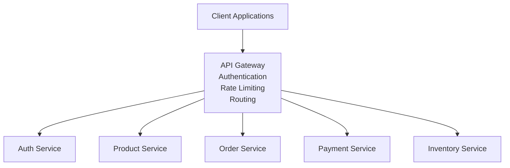
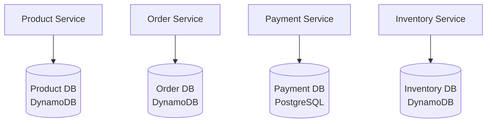
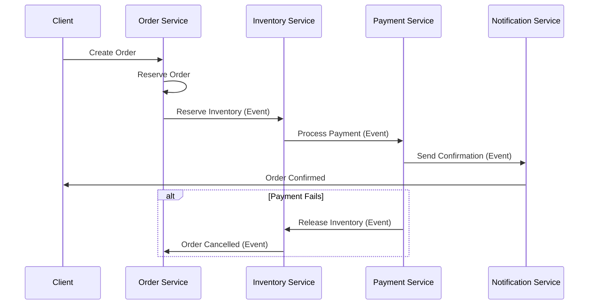
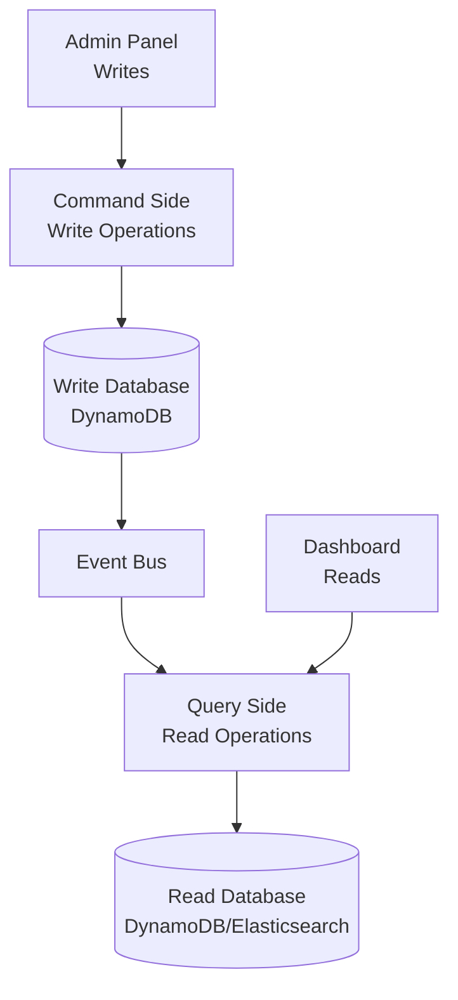
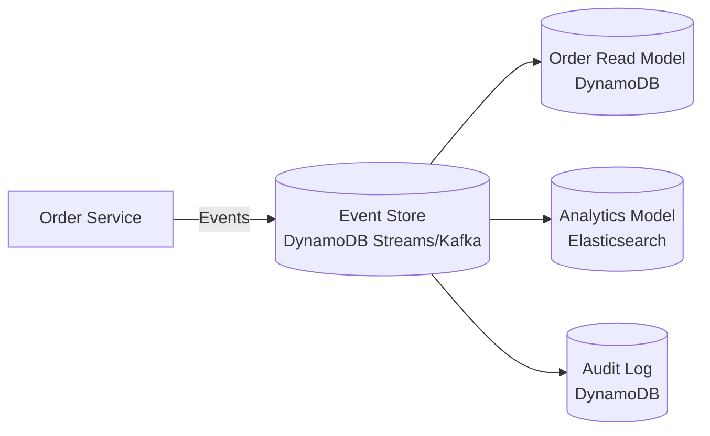
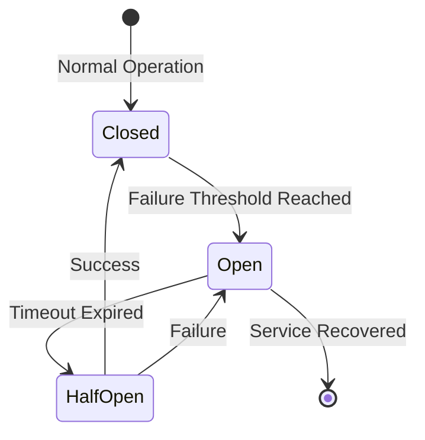
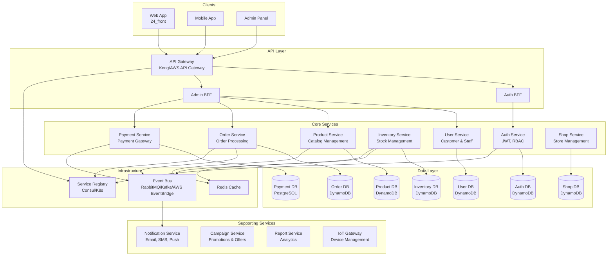

# Microservices Architecture Overview

## Introduction

This document provides a comprehensive overview of the microservices architecture for the Retail ERP system. The architecture is designed to be scalable, maintainable, and adaptable to various industries beyond retail.

## Current State

The system currently operates as a **monolithic Node.js application** (`24_api`) with:

- Single Express.js API server handling all business domains
- **DynamoDB** as the primary database (using OneTable pattern)
- Next.js frontend (`24_front`)
- One Go microservice (`vm-service`) communicating via gRPC
- Multiple business domains tightly coupled in one codebase

## Target Architecture

The target architecture follows microservices principles with:

- **Independent services** for each business domain
- **Database per service** pattern (DynamoDB for most services)
- **API Gateway** as single entry point
- **Event-driven communication** for loose coupling
- **Service discovery** for dynamic service location
- **Container orchestration** for deployment and scaling

## Core Microservice Patterns

### 1. API Gateway Pattern

**Purpose**: Single entry point for all client requests, routing to appropriate microservices.

**Benefits for Retail ERP:**
- Centralized authentication/authorization
- Rate limiting and throttling
- Request/response transformation
- Load balancing across services
- API versioning

**Implementation**: Kong, AWS API Gateway, or NGINX

### 2. Database per Service Pattern

**Purpose**: Each microservice has its own database, ensuring loose coupling.

**Benefits for Retail ERP:**
- Independent scaling
- Technology diversity (DynamoDB for most, PostgreSQL for transactions)
- Data isolation and security
- Independent deployment

**Current Implementation**: DynamoDB with OneTable pattern

**Diagram:**

### 3. Saga Pattern

**Purpose**: Manage distributed transactions across multiple services.

**Critical for Retail ERP**: Order processing involves multiple services (inventory, payment, shipping).

**Implementation**: Event-driven choreography pattern

### 4. CQRS (Command Query Responsibility Segregation)

**Purpose**: Separate read and write operations for better performance and scalability.

**Benefits for Retail ERP:**
- Optimized read models for reporting
- Independent scaling of read/write operations
- Better performance for analytics dashboards

**Diagram:**

### 5. Event Sourcing Pattern

**Purpose**: Store all changes as a sequence of events, enabling audit trails and time travel.

**Benefits for Retail ERP:**
- Complete audit trail (critical for compliance)
- Replay events for debugging
- Build multiple read models from events
- Financial transaction history

**Diagram:**

### 6. Circuit Breaker Pattern

**Purpose**: Prevent cascading failures by stopping requests to failing services.

**Critical for Retail ERP**: Payment service failure shouldn't crash the entire system.

**Implementation**: Use libraries like `opossum` (Node.js) or `resilience4j` (Java)

## Service Architecture Overview

## Communication Patterns

### Synchronous Communication

**REST API**: Used for real-time operations requiring immediate response
- Order → Inventory (stock check)
- Order → Payment (payment processing)

**gRPC**: Used for inter-service communication requiring high performance
- IoT Gateway → Shop Service (device status)
- vm-service → Shop Service (vending machine operations)

### Asynchronous Communication

**Event-Driven**: Used for eventual consistency and decoupling
- Order created → Notification service
- Inventory updated → Report service
- Payment processed → Order service

**Message Queue**: RabbitMQ, Apache Kafka, or AWS EventBridge
- Reliable message delivery
- Event replay capability
- Multiple consumers support

## Technology Stack

### Current Stack (24_api)
- **Runtime**: Node.js (>=12.0.0)
- **Framework**: Express.js
- **Database**: DynamoDB (OneTable pattern)
- **Cache**: Redis
- **Message Queue**: Bull/BullMQ (Redis-based)
- **Authentication**: JWT (Passport.js)
- **gRPC**: @grpc/grpc-js

### Target Stack (Microservices)

See [Service Boundaries](./service-boundaries.md) for detailed tech stack per service.

## Migration Strategy

We follow the **Strangler Fig Pattern** to gradually migrate from monolith to microservices:

1. **Phase 1**: Extract Authentication Service
2. **Phase 2**: Extract Product & Inventory Services
3. **Phase 3**: Extract Order Service
4. **Phase 4**: Extract Payment Service
5. **Phase 5**: Extract Supporting Services

Each phase maintains backward compatibility with the existing monolith.

## Benefits

### Scalability
- Scale individual services based on demand
- Inventory service scales during peak shopping seasons
- Report service scales for batch processing

### Reliability
- Service failures are isolated
- Circuit breakers prevent cascading failures
- Health checks ensure service availability

### Maintainability
- Teams can work independently on services
- Technology diversity (use best tool for each service)
- Easier to test and deploy

### Performance
- Optimized databases per service
- Caching strategies per service
- Read/write separation (CQRS)

## Cross-Industry Applicability

This architecture is adaptable to:

1. **E-commerce**: Same core services (Product, Order, Payment, Inventory)
2. **Healthcare**: Replace Shop with Clinic, add Patient Service
3. **Manufacturing**: Add Production Service, Supply Chain Service
4. **Hospitality**: Add Booking Service, Room Service
5. **Logistics**: Add Shipping Service, Route Optimization Service

## Next Steps

1. Review [Service Boundaries](./service-boundaries.md) for detailed service definitions
2. Review [Communication Patterns](./communication-patterns.md) for inter-service communication
3. Set up development environment with Docker Compose
4. Start with Auth Service extraction (lowest risk)
5. Implement API Gateway to route traffic
6. Set up monitoring and observability
