# Microservice Architecture Redesign Plan

## Current State Analysis

Your current system is a **monolithic Node.js application** (`24_api`) with:

- Single Express.js API server handling all domains
- **DynamoDB** as primary database (using OneTable pattern)
- Next.js frontend (`24_front`)
- One Go microservice (`vm-service`) communicating via gRPC
- Multiple business domains mixed in one codebase

**Identified Business Domains:**

- Authentication & User Management
- Product & Inventory Management
- Order Management
- Shop/Store Management
- Payment Processing
- Campaign & Promotions
- Reporting & Analytics
- Notifications
- IoT Device Management
- Support & Tickets

## Microservice Patterns Overview

### 1. API Gateway Pattern

**Purpose**: Single entry point for all client requests, routing to appropriate microservices.

**Benefits for Retail ERP:**

- Centralized authentication/authorization
- Rate limiting and throttling
- Request/response transformation
- Load balancing across services
- API versioning

**Diagram:**

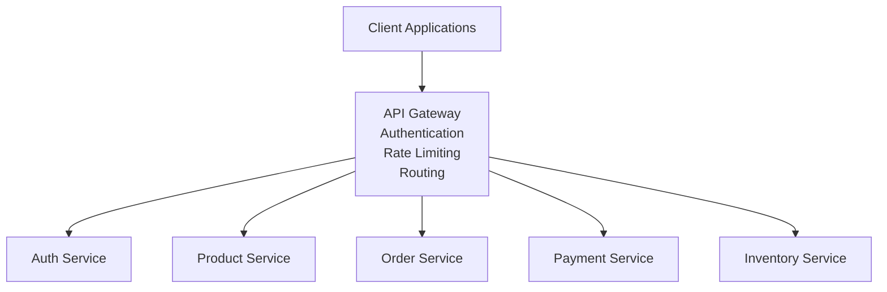

### 2. Service Discovery Pattern

**Purpose**: Services register themselves and discover other services dynamically.

**Benefits:**

- Dynamic scaling
- Health checking
- Load distribution
- Service resilience

**Implementation Options:**

- **Client-side discovery**: Consul, Eureka
- **Server-side discovery**: Kubernetes DNS, AWS ECS Service Discovery

**Diagram:**

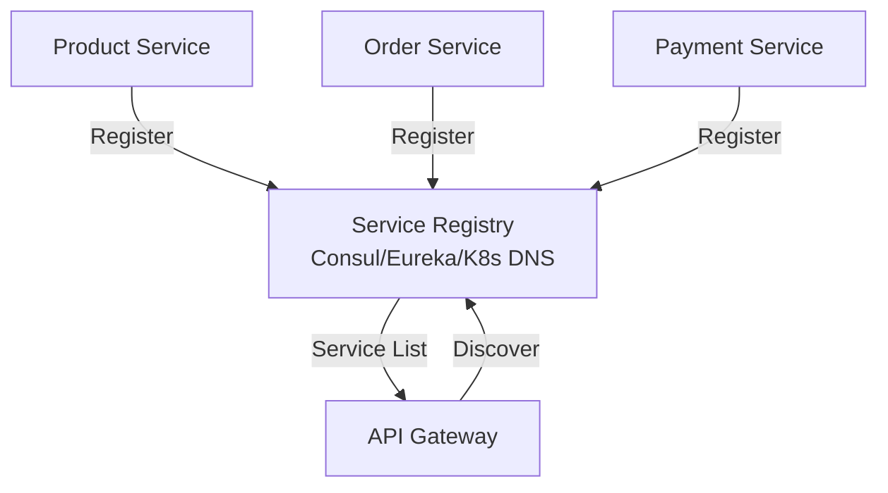

### 3. Database per Service Pattern

**Purpose**: Each microservice has its own database, ensuring loose coupling.

**Benefits for Retail ERP:**

- Independent scaling
- Technology diversity (SQL for orders, NoSQL for products)
- Data isolation and security
- Independent deployment

**Diagram:**

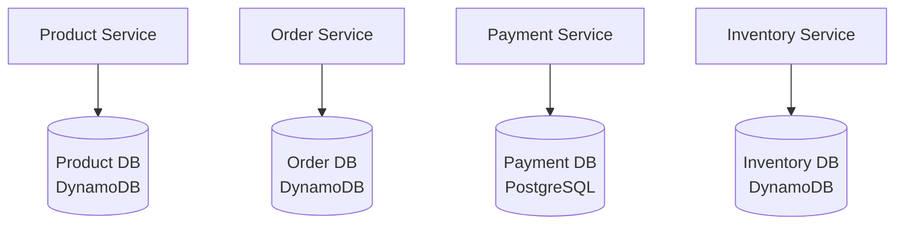

### 4. Saga Pattern

**Purpose**: Manage distributed transactions across multiple services.

**Critical for Retail ERP**: Order processing involves multiple services (inventory, payment, shipping).

**Two Approaches:**

**Choreography (Event-Driven):**

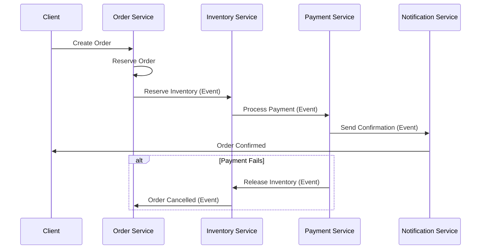

**Orchestration (Centralized):**

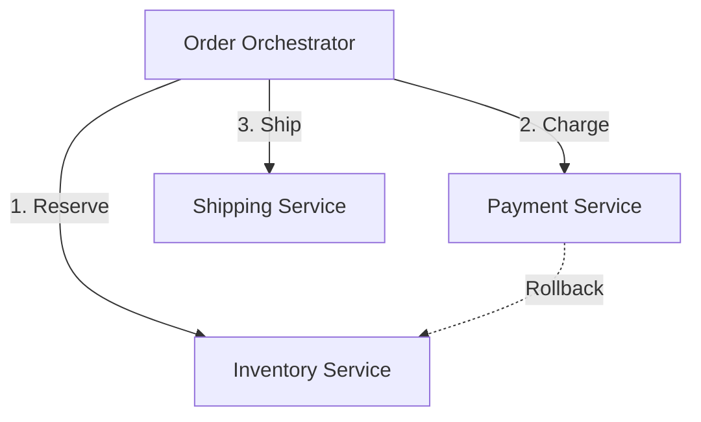

### 5. CQRS (Command Query Responsibility Segregation)

**Purpose**: Separate read and write operations for better performance and scalability.

**Benefits for Retail ERP:**

- Optimized read models for reporting
- Independent scaling of read/write operations
- Better performance for analytics dashboards

**Diagram:**

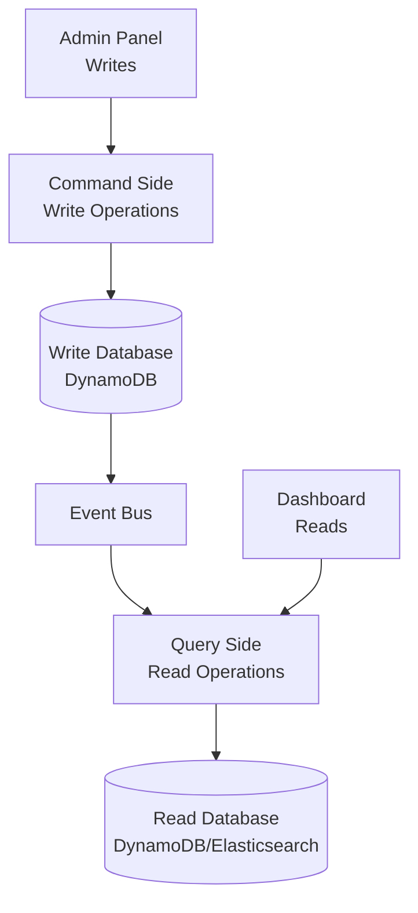

### 6. Event Sourcing Pattern

**Purpose**: Store all changes as a sequence of events, enabling audit trails and time travel.

**Benefits for Retail ERP:**

- Complete audit trail (critical for compliance)
- Replay events for debugging
- Build multiple read models from events
- Financial transaction history

**Diagram:**

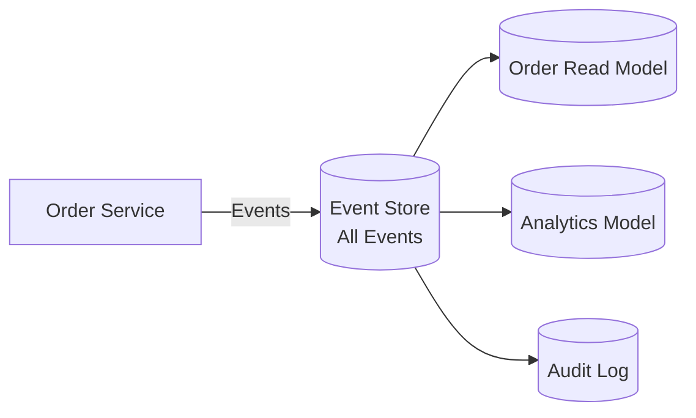

### 7. Circuit Breaker Pattern

**Purpose**: Prevent cascading failures by stopping requests to failing services.

**Critical for Retail ERP**: Payment service failure shouldn't crash the entire system.

**Diagram:**

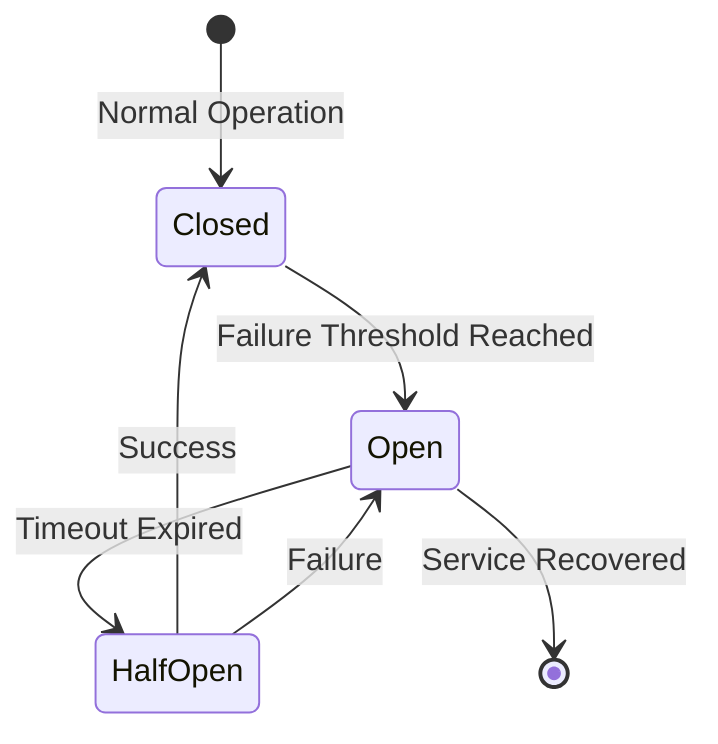

### 8. Bulkhead Pattern

**Purpose**: Isolate resources to prevent one service from consuming all resources.

**Benefits:**

- Payment processing isolated from reporting
- Critical services protected from non-critical ones

**Diagram:**

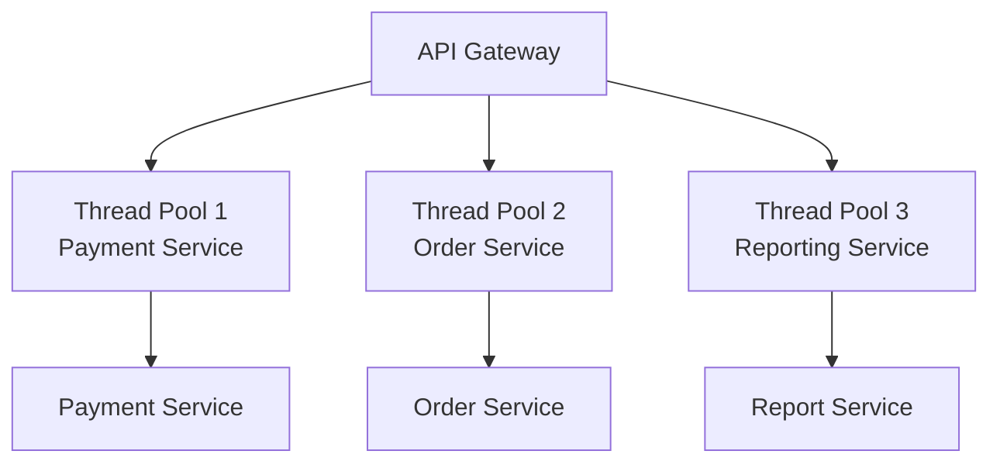

### 9. Strangler Fig Pattern

**Purpose**: Gradually migrate from monolith to microservices by replacing features incrementally.

**Perfect for your migration strategy!**

**Diagram:**

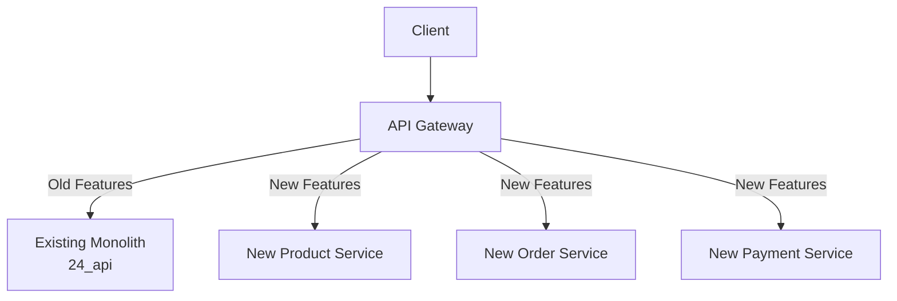

### 10. Backend for Frontend (BFF) Pattern

**Purpose**: Create separate backend services optimized for different client types.

**Benefits for Retail ERP:**

- Mobile app needs different data than web dashboard
- Admin panel vs customer app optimization

**Diagram:**

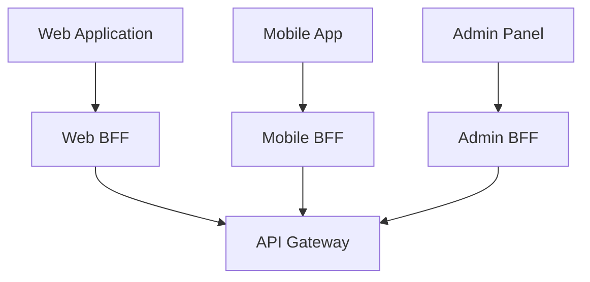

### 11. API Composition Pattern

**Purpose**: Aggregate data from multiple services for client requests.

**Example**: Order details page needs data from Order, Product, and Customer services.

**Diagram:**

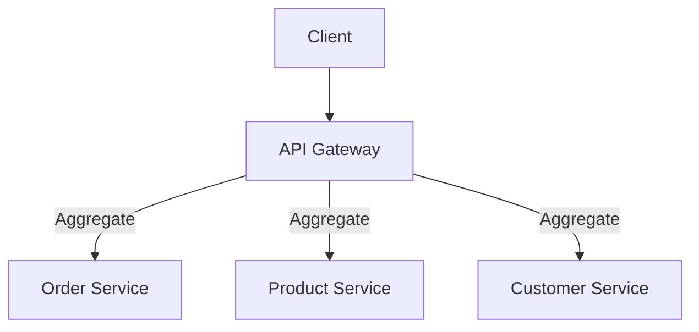

### 12. Service Mesh Pattern

**Purpose**: Handle cross-cutting concerns (security, observability, traffic management) at infrastructure level.

**Benefits:**

- Centralized service-to-service communication
- Automatic mTLS
- Distributed tracing
- Load balancing

**Diagram:**

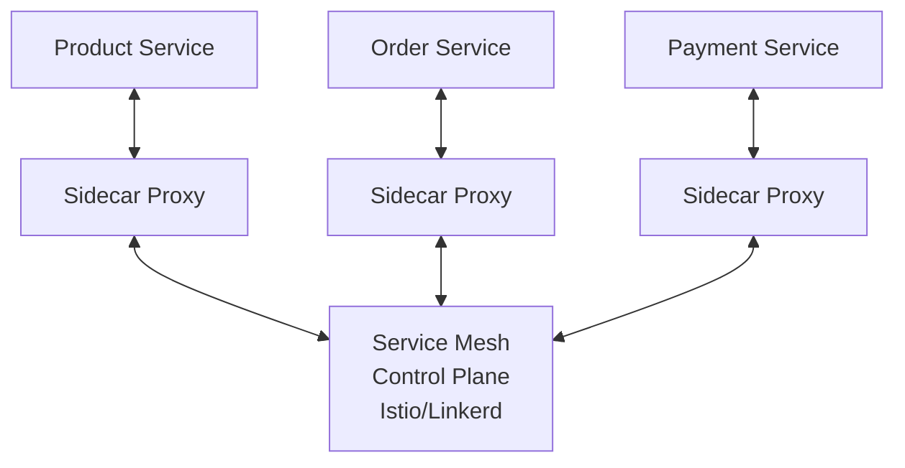

## Proposed Microservice Architecture for Retail ERP

### Phase 1: Core Services (Priority)

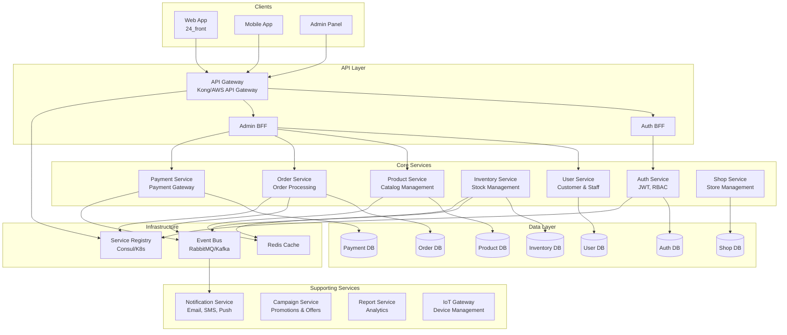

### Service Boundaries & Responsibilities

1. **Auth Service**

   - Authentication (JWT tokens)
   - Authorization (RBAC)
   - Session management
   - OAuth integration

2. **User Service**

   - Customer profiles
   - Staff/Admin management
   - User preferences
   - Age verification

3. **Product Service**

   - Product catalog
   - Product attributes
   - Categories & tags
   - Product search (integrate with Elasticsearch)

4. **Inventory Service**

   - Stock levels
   - Warehouse management
   - RFID tracking
   - Stock movements
   - Low stock alerts

5. **Order Service**

   - Order creation
   - Order status management
   - Order history
   - Order orchestration (Saga)

6. **Payment Service**

   - Payment processing
   - Multiple payment gateways (SwishPay, D2IPay)
   - Refund processing
   - Payment reconciliation

7. **Shop Service**

   - Store information
   - Store configuration
   - Vending machine management (VM, VM20)
   - Store settings

8. **Campaign Service**

   - Promotional campaigns
   - Discount rules
   - Conditional pricing
   - Offer management

9. **Notification Service**

   - Email notifications
   - SMS notifications
   - Push notifications
   - In-app notifications

10. **Report Service**

    - Sales reports
    - Inventory reports
    - Financial reports
    - Custom report generation

11. **IoT Gateway Service**

    - Device management
    - Device communication (gRPC)
    - Device status monitoring
    - Fridge, TV, RFID device management

## Communication Patterns

### Synchronous Communication (REST/gRPC)

- **When to use**: Real-time operations (payment processing, inventory checks)
- **Services**: Order → Inventory, Order → Payment

### Asynchronous Communication (Events)

- **When to use**: Non-critical operations, eventual consistency
- **Services**: Order created → Notification, Inventory updated → Report update

### Event Flow Example: Order Processing

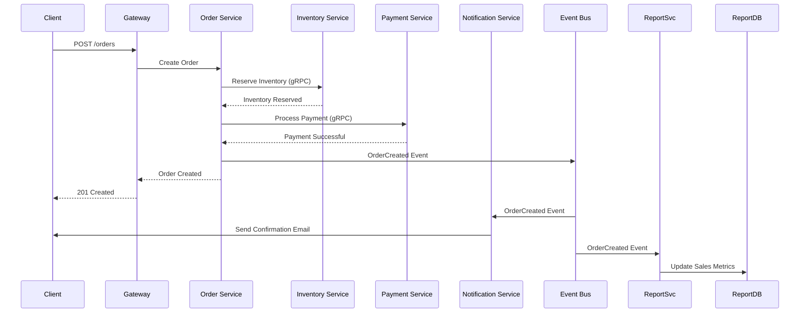

## Technology Stack Recommendations

### API Gateway

- **Kong** (Open source, plugin ecosystem)
- **AWS API Gateway** (If using AWS)
- **NGINX** (Lightweight option)

### Service Communication

- **REST**: Express.js, Fastify
- **gRPC**: Already in use for vm-service
- **Events**: RabbitMQ, Apache Kafka, AWS EventBridge

### Databases

- **DynamoDB**: Most services (Products, Inventory, Orders, Users, Shops, Campaigns) - using OneTable pattern
- **PostgreSQL**: Payment Service (ACID compliance for financial transactions)
- **Redis**: Caching, session storage
- **Elasticsearch**: Product search, analytics, reporting

### Service Discovery

- **Kubernetes DNS** (if using K8s)
- **Consul** (standalone)
- **AWS ECS Service Discovery** (if using AWS)

### Monitoring & Observability

- **Prometheus + Grafana**: Metrics
- **Jaeger/Zipkin**: Distributed tracing
- **ELK Stack**: Logging
- **Sentry**: Error tracking

### Container Orchestration

- **Kubernetes**: Production-grade orchestration
- **Docker Compose**: Development
- **AWS ECS/Fargate**: Managed alternative

## Detailed Technology Stack by Service

### Auth Service

- **Runtime**: Node.js 18+
- **Framework**: Express.js or Fastify
- **Database**: DynamoDB (OneTable pattern) - `auth-tokens`, `sessions`, `refresh-tokens`
- **Cache**: Redis (token blacklisting, session storage)
- **Auth Libraries**: JWT (jsonwebtoken), Passport.js
- **Validation**: Joi
- **Testing**: Jest, Supertest
- **Monitoring**: Winston logger, Prometheus metrics

### User Service

- **Runtime**: Node.js 18+
- **Framework**: Express.js or Fastify
- **Database**: DynamoDB (OneTable pattern) - `users`, `customers`, `staff`
- **Cache**: Redis (frequently accessed user data)
- **Search**: Elasticsearch (for user search if needed)
- **Validation**: Joi
- **Testing**: Jest, Supertest
- **Monitoring**: Winston logger, Prometheus metrics

### Product Service

- **Runtime**: Node.js 18+
- **Framework**: Express.js or Fastify
- **Database**: DynamoDB (OneTable pattern) - `products`, `categories`, `tags`
- **Search**: Elasticsearch (product search)
- **Cache**: Redis (product catalog caching)
- **Storage**: AWS S3 (product images)
- **Validation**: Joi
- **Testing**: Jest, Supertest
- **Monitoring**: Winston logger, Prometheus metrics

### Inventory Service

- **Runtime**: Node.js 18+
- **Framework**: Express.js or Fastify
- **Database**: DynamoDB (OneTable pattern) - `inventory`, `stock-movements`, `warehouses`
- **Cache**: Redis (real-time stock levels)
- **Message Queue**: RabbitMQ/Kafka (stock update events)
- **Validation**: Joi
- **Testing**: Jest, Supertest
- **Monitoring**: Winston logger, Prometheus metrics

### Order Service

- **Runtime**: Node.js 18+
- **Framework**: Express.js or Fastify
- **Database**: DynamoDB (OneTable pattern) - `orders`, `order-items`, `order-history`
- **Cache**: Redis (order status caching)
- **Message Queue**: RabbitMQ/Kafka (order events)
- **Saga Orchestration**: Custom implementation or Temporal
- **Validation**: Joi
- **Testing**: Jest, Supertest
- **Monitoring**: Winston logger, Prometheus metrics, Distributed tracing

### Payment Service

- **Runtime**: Node.js 18+
- **Framework**: Express.js or Fastify
- **Database**: PostgreSQL (ACID compliance) - `payments`, `refunds`, `payment_transactions`
- **Cache**: Redis (payment status caching)
- **Message Queue**: RabbitMQ/Kafka (payment events)
- **Security**: Encryption at rest, PCI DSS compliance, Tokenization
- **Validation**: Joi
- **Testing**: Jest, Supertest
- **Monitoring**: Winston logger, Prometheus metrics, Security audit logs

### Shop Service

- **Runtime**: Node.js 18+
- **Framework**: Express.js or Fastify
- **Database**: DynamoDB (OneTable pattern) - `shops`, `shop-settings`, `vending-machines`
- **Cache**: Redis (shop configuration caching)
- **gRPC**: @grpc/grpc-js (for vm-service communication)
- **Validation**: Joi
- **Testing**: Jest, Supertest
- **Monitoring**: Winston logger, Prometheus metrics

### Notification Service

- **Runtime**: Node.js 18+
- **Framework**: Express.js or Fastify
- **Database**: DynamoDB (OneTable pattern) - `notifications`, `notification-templates`, `notification-logs`
- **Email**: Nodemailer, AWS SES
- **SMS**: Twilio, AWS SNS
- **Push**: Firebase Cloud Messaging (FCM)
- **Message Queue**: RabbitMQ/Kafka (async notification processing)
- **Validation**: Joi
- **Testing**: Jest, Supertest
- **Monitoring**: Winston logger, Prometheus metrics

### Campaign Service

- **Runtime**: Node.js 18+
- **Framework**: Express.js or Fastify
- **Database**: DynamoDB (OneTable pattern) - `campaigns`, `offers`, `pricing-rules`
- **Cache**: Redis (active campaign caching)
- **Rule Engine**: Custom or Drools (complex pricing rules)
- **Validation**: Joi
- **Testing**: Jest, Supertest
- **Monitoring**: Winston logger, Prometheus metrics

### Report Service

- **Runtime**: Node.js 18+
- **Framework**: Express.js or Fastify
- **Database**: DynamoDB (report metadata), Elasticsearch (analytics), PostgreSQL (complex aggregations if needed)
- **Cache**: Redis (report caching)
- **Report Generation**: PDFKit/Puppeteer (PDF), ExcelJS (Excel)
- **Analytics**: Elasticsearch aggregations
- **Validation**: Joi
- **Testing**: Jest, Supertest
- **Monitoring**: Winston logger, Prometheus metrics

### IoT Gateway Service

- **Runtime**: Node.js 18+ or Go (better gRPC performance)
- **Framework**: Express.js (Node.js) or Gin (Go)
- **Database**: DynamoDB (OneTable pattern) - `devices`, `device-status`, `device-logs`
- **gRPC**: @grpc/grpc-js (Node.js) or native gRPC (Go)
- **Message Queue**: RabbitMQ/Kafka (device events)
- **Protocol**: MQTT (IoT device communication)
- **Validation**: Joi (Node.js) or validator (Go)
- **Testing**: Jest (Node.js) or Go testing
- **Monitoring**: Winston logger (Node.js), Prometheus metrics

## Migration Strategy (Strangler Fig Pattern)

### Phase 1: Extract Authentication (Weeks 1-2)

- Extract auth logic to separate service
- Keep existing API working
- Gradually migrate endpoints

### Phase 2: Extract Product & Inventory (Weeks 3-4)

- Most read-heavy services
- Easy to extract
- Immediate performance benefits

### Phase 3: Extract Order Service (Weeks 5-6)

- Most complex service
- Implement Saga pattern
- Critical for business

### Phase 4: Extract Payment Service (Weeks 7-8)

- High security requirements
- Isolate payment processing
- Implement circuit breaker

### Phase 5: Extract Supporting Services (Weeks 9-12)

- Campaign, Notification, Report services
- Less critical, can be done incrementally

## Cross-Industry Applicability

This architecture is adaptable to:

1. **E-commerce**: Same core services (Product, Order, Payment, Inventory)
2. **Healthcare**: Replace Shop with Clinic, add Patient Service
3. **Manufacturing**: Add Production Service, Supply Chain Service
4. **Hospitality**: Add Booking Service, Room Service
5. **Logistics**: Add Shipping Service, Route Optimization Service

**Key Adaptable Components:**

- API Gateway pattern (universal)
- Service discovery (all industries)
- Event-driven architecture (all industries)
- CQRS for reporting (all industries)

## Benefits Summary

### For Retail ERP

- **Scalability**: Scale inventory service during peak shopping seasons
- **Reliability**: Payment service failure doesn't crash entire system
- **Performance**: Optimized read models for dashboards
- **Maintainability**: Teams can work independently
- **Technology Diversity**: Use best tool for each service

### For Other Industries

- **Modularity**: Easy to add/remove services
- **Compliance**: Isolated services for regulatory requirements
- **Integration**: Easy to integrate with third-party services
- **Multi-tenancy**: Each service can handle multi-tenancy differently

## Implementation Files to Create

1. **Architecture Documentation**

   - `docs/architecture/microservices-overview.md`
   - `docs/architecture/service-boundaries.md`
   - `docs/architecture/communication-patterns.md`

2. **Service Definitions**

   - `services/auth-service/` (new)
   - `services/product-service/` (new)
   - `services/order-service/` (new)
   - `services/payment-service/` (new)
   - `services/inventory-service/` (new)

3. **Infrastructure**

   - `infrastructure/docker-compose.microservices.yml`
   - `infrastructure/kubernetes/` (if using K8s)
   - `infrastructure/api-gateway/` (Kong config)

4. **Shared Libraries**

   - `libs/shared/` (common utilities, types, events)

## Next Steps

1. **Review and approve** this architecture plan
2. **Set up development environment** with Docker Compose
3. **Start with Auth Service** extraction (lowest risk)
4. **Implement API Gateway** to route traffic
5. **Set up monitoring** before migration
6. **Gradually migrate** services using Strangler Fig pattern