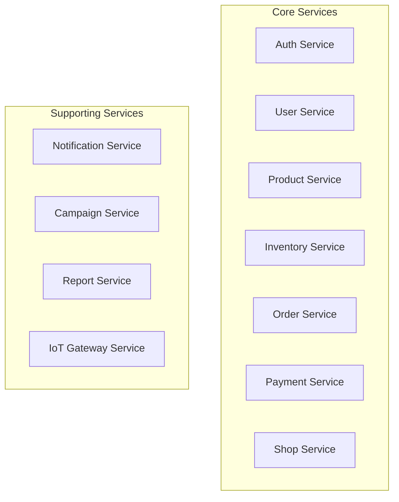

# Service Boundaries & Technology Stack

This document defines the boundaries, responsibilities, and technology stack for each microservice in the Retail ERP system.

## Service Overview



## Core Services

### 1. Auth Service

**Purpose**: Authentication and authorization for all services.

**Responsibilities:**
- User authentication (login, registration)
- JWT token generation and validation
- Role-based access control (RBAC)
- Session management
- OAuth integration (if needed)
- Password reset and email verification

**Technology Stack:**
- **Runtime**: Node.js 18+
- **Framework**: Express.js or Fastify
- **Database**: DynamoDB (OneTable pattern)
  - Table: `auth-tokens`, `sessions`, `refresh-tokens`
- **Cache**: Redis (for token blacklisting and session storage)
- **Authentication**: 
  - JWT (jsonwebtoken)
  - Passport.js (for OAuth if needed)
- **Validation**: Joi
- **Testing**: Jest, Supertest
- **Monitoring**: Winston logger, Prometheus metrics

**API Endpoints:**
- `POST /auth/login`
- `POST /auth/register`
- `POST /auth/refresh-token`
- `POST /auth/logout`
- `POST /auth/forgot-password`
- `POST /auth/reset-password`
- `GET /auth/verify-email`

**Database Schema (DynamoDB):**
```javascript
{
  pk: "auth#${userId}",
  sk: "token#${tokenId}",
  userId: String,
  token: String,
  type: "access" | "refresh",
  expiresAt: Number,
  createdAt: Number
}
```

**Dependencies:**
- User Service (for user validation)
- Notification Service (for email verification, password reset)

---

### 2. User Service

**Purpose**: Manage user profiles, customers, and staff.

**Responsibilities:**
- Customer profile management
- Staff/Admin user management
- User preferences and settings
- Age verification
- Social user pre-authorization
- User search and filtering

**Technology Stack:**
- **Runtime**: Node.js 18+
- **Framework**: Express.js or Fastify
- **Database**: DynamoDB (OneTable pattern)
  - Table: `users`, `customers`, `staff`
- **Cache**: Redis (for frequently accessed user data)
- **Search**: Elasticsearch (for user search if needed)
- **Validation**: Joi
- **Testing**: Jest, Supertest
- **Monitoring**: Winston logger, Prometheus metrics

**API Endpoints:**
- `GET /users/:userId`
- `POST /users`
- `PUT /users/:userId`
- `DELETE /users/:userId`
- `GET /users/customers`
- `GET /users/staff`
- `POST /users/customer/age-verify`
- `POST /users/customer/social-preauth`

**Database Schema (DynamoDB):**
```javascript
{
  pk: "user#${userId}",
  sk: "profile",
  userId: String,
  email: String,
  name: String,
  role: "customer" | "staff" | "admin",
  preferences: Object,
  createdAt: Number,
  updatedAt: Number
}
```

**Dependencies:**
- Auth Service (for authentication)
- Notification Service (for user notifications)

---

### 3. Product Service

**Purpose**: Manage product catalog and product information.

**Responsibilities:**
- Product catalog management
- Product attributes and metadata
- Categories and tags
- Product search and filtering
- Product images and media
- Product pricing (base prices)

**Technology Stack:**
- **Runtime**: Node.js 18+
- **Framework**: Express.js or Fastify
- **Database**: DynamoDB (OneTable pattern)
  - Table: `products`, `categories`, `tags`
- **Search**: Elasticsearch (for product search)
- **Cache**: Redis (for product catalog caching)
- **Storage**: AWS S3 (for product images)
- **Validation**: Joi
- **Testing**: Jest, Supertest
- **Monitoring**: Winston logger, Prometheus metrics

**API Endpoints:**
- `GET /products`
- `GET /products/:productId`
- `POST /products`
- `PUT /products/:productId`
- `DELETE /products/:productId`
- `GET /products/search`
- `GET /products/categories`
- `GET /products/tags`

**Database Schema (DynamoDB):**
```javascript
{
  pk: "product#${productId}",
  sk: "info",
  productId: String,
  name: String,
  description: String,
  category: String,
  tags: Array,
  attributes: Object,
  basePrice: Number,
  images: Array,
  createdAt: Number,
  updatedAt: Number
}
```

**Dependencies:**
- Campaign Service (for promotional pricing)
- Inventory Service (for stock availability)

---

### 4. Inventory Service

**Purpose**: Manage inventory, stock levels, and warehouse operations.

**Responsibilities:**
- Stock level management
- Warehouse management
- RFID tracking
- Stock movements and transactions
- Low stock alerts
- FIFO/LIFO inventory management
- Expiration date tracking

**Technology Stack:**
- **Runtime**: Node.js 18+
- **Framework**: Express.js or Fastify
- **Database**: DynamoDB (OneTable pattern)
  - Table: `inventory`, `stock-movements`, `warehouses`
- **Cache**: Redis (for real-time stock levels)
- **Message Queue**: RabbitMQ/Kafka (for stock update events)
- **Validation**: Joi
- **Testing**: Jest, Supertest
- **Monitoring**: Winston logger, Prometheus metrics

**API Endpoints:**
- `GET /inventory/:shopId/:productId`
- `GET /inventory/:shopId`
- `POST /inventory/stock-movement`
- `PUT /inventory/:shopId/:productId`
- `GET /inventory/low-stock-alerts`
- `POST /inventory/rfid-track`

**Database Schema (DynamoDB):**
```javascript
{
  pk: "inventory#${shopId}#${stripeCode}",
  sk: "${type}#${date}#${id}",
  shopId: String,
  stripeCode: String,
  totalStock: Number,
  totalValue: Number,
  expirationDate: String,
  lastRestocked: Number,
  fifoData: String,
  createdAt: Number,
  updatedAt: Number
}
```

**Dependencies:**
- Product Service (for product information)
- Order Service (for stock reservation)
- Shop Service (for shop information)
- Notification Service (for low stock alerts)

**Events Published:**
- `InventoryReserved`
- `InventoryReleased`
- `StockUpdated`
- `LowStockAlert`

**Events Consumed:**
- `OrderCreated` (from Order Service)
- `OrderCancelled` (from Order Service)

---

### 5. Order Service

**Purpose**: Manage order processing and order lifecycle.

**Responsibilities:**
- Order creation and management
- Order status management
- Order history
- Order orchestration (Saga pattern)
- Order cancellation and refunds
- Order reporting

**Technology Stack:**
- **Runtime**: Node.js 18+
- **Framework**: Express.js or Fastify
- **Database**: DynamoDB (OneTable pattern)
  - Table: `orders`, `order-items`, `order-history`
- **Cache**: Redis (for order status caching)
- **Message Queue**: RabbitMQ/Kafka (for order events)
- **Saga Orchestration**: Custom implementation or Temporal
- **Validation**: Joi
- **Testing**: Jest, Supertest
- **Monitoring**: Winston logger, Prometheus metrics, Distributed tracing

**API Endpoints:**
- `POST /orders`
- `GET /orders/:orderId`
- `GET /orders` (list with filters)
- `PUT /orders/:orderId/status`
- `POST /orders/:orderId/cancel`
- `GET /orders/:orderId/history`

**Database Schema (DynamoDB):**
```javascript
{
  pk: "order#${shopId}#${orderId}",
  sk: "${orderId}",
  orderId: String,
  shopId: String,
  userId: String,
  items: Array,
  status: "pending" | "confirmed" | "processing" | "completed" | "cancelled",
  totalAmount: Number,
  createdAt: Number,
  updatedAt: Number
}
```

**Dependencies:**
- Inventory Service (for stock reservation)
- Payment Service (for payment processing)
- Product Service (for product information)
- User Service (for customer information)
- Notification Service (for order confirmations)

**Events Published:**
- `OrderCreated`
- `OrderConfirmed`
- `OrderCancelled`
- `OrderCompleted`

**Events Consumed:**
- `PaymentProcessed` (from Payment Service)
- `PaymentFailed` (from Payment Service)
- `InventoryReserved` (from Inventory Service)

---

### 6. Payment Service

**Purpose**: Handle payment processing and payment gateway integrations.

**Responsibilities:**
- Payment processing
- Multiple payment gateway integrations (SwishPay, D2IPay)
- Refund processing
- Payment reconciliation
- Payment history
- Payment security and PCI compliance

**Technology Stack:**
- **Runtime**: Node.js 18+
- **Framework**: Express.js or Fastify
- **Database**: PostgreSQL (for ACID compliance and financial transactions)
  - Tables: `payments`, `refunds`, `payment_transactions`
- **Cache**: Redis (for payment status caching)
- **Message Queue**: RabbitMQ/Kafka (for payment events)
- **Security**: 
  - Encryption at rest
  - PCI DSS compliance
  - Tokenization for sensitive data
- **Validation**: Joi
- **Testing**: Jest, Supertest
- **Monitoring**: Winston logger, Prometheus metrics, Security audit logs

**API Endpoints:**
- `POST /payments/process`
- `GET /payments/:paymentId`
- `POST /payments/:paymentId/refund`
- `GET /payments` (list with filters)
- `POST /payments/reconcile`

**Database Schema (PostgreSQL):**
```sql
CREATE TABLE payments (
  id UUID PRIMARY KEY,
  order_id VARCHAR(255) NOT NULL,
  user_id VARCHAR(255) NOT NULL,
  amount DECIMAL(10,2) NOT NULL,
  currency VARCHAR(3) DEFAULT 'SEK',
  status VARCHAR(50) NOT NULL,
  payment_method VARCHAR(50),
  gateway VARCHAR(50),
  gateway_transaction_id VARCHAR(255),
  created_at TIMESTAMP DEFAULT NOW(),
  updated_at TIMESTAMP DEFAULT NOW()
);
```

**Dependencies:**
- Order Service (for order information)
- Auth Service (for payment authorization)

**Events Published:**
- `PaymentProcessed`
- `PaymentFailed`
- `RefundProcessed`

**Events Consumed:**
- `OrderCreated` (from Order Service)

**Security Considerations:**
- Never store full credit card numbers
- Use tokenization for payment methods
- Encrypt sensitive payment data
- Implement rate limiting
- Audit all payment operations

---

### 7. Shop Service

**Purpose**: Manage shop/store information and configuration.

**Responsibilities:**
- Shop/store information management
- Shop configuration and settings
- Vending machine management (VM, VM20)
- Shop location and metadata
- Shop-specific settings

**Technology Stack:**
- **Runtime**: Node.js 18+
- **Framework**: Express.js or Fastify
- **Database**: DynamoDB (OneTable pattern)
  - Table: `shops`, `shop-settings`, `vending-machines`
- **Cache**: Redis (for shop configuration caching)
- **gRPC**: For communication with vm-service
- **Validation**: Joi
- **Testing**: Jest, Supertest
- **Monitoring**: Winston logger, Prometheus metrics

**API Endpoints:**
- `GET /shops/:shopId`
- `GET /shops`
- `POST /shops`
- `PUT /shops/:shopId`
- `GET /shops/:shopId/vending-machines`
- `POST /shops/:shopId/vending-machines`
- `PUT /shops/:shopId/settings`

**Database Schema (DynamoDB):**
```javascript
{
  pk: "shop#${shopId}",
  sk: "info",
  shopId: String,
  name: String,
  address: Object,
  settings: Object,
  environment: "prod" | "demo" | "master",
  metadata: Object,
  createdAt: Number,
  updatedAt: Number
}
```

**Dependencies:**
- IoT Gateway Service (for device management)
- Auth Service (for shop access control)

**gRPC Services:**
- `VerifyStoreAccess`
- `GetStoreInfo`

---

## Supporting Services

### 8. Notification Service

**Purpose**: Handle all types of notifications (email, SMS, push).

**Responsibilities:**
- Email notifications
- SMS notifications
- Push notifications (mobile)
- In-app notifications
- Notification templates
- Notification delivery tracking

**Technology Stack:**
- **Runtime**: Node.js 18+
- **Framework**: Express.js or Fastify
- **Database**: DynamoDB (OneTable pattern)
  - Table: `notifications`, `notification-templates`, `notification-logs`
- **Email**: Nodemailer, AWS SES
- **SMS**: Twilio, AWS SNS
- **Push**: Firebase Cloud Messaging (FCM)
- **Message Queue**: RabbitMQ/Kafka (for async notification processing)
- **Validation**: Joi
- **Testing**: Jest, Supertest
- **Monitoring**: Winston logger, Prometheus metrics

**API Endpoints:**
- `POST /notifications/send`
- `GET /notifications/:notificationId`
- `GET /notifications` (list with filters)
- `POST /notifications/templates`

**Database Schema (DynamoDB):**
```javascript
{
  pk: "notification#${notificationId}",
  sk: "info",
  notificationId: String,
  userId: String,
  type: "email" | "sms" | "push",
  status: "pending" | "sent" | "failed",
  content: Object,
  sentAt: Number,
  createdAt: Number
}
```

**Dependencies:**
- User Service (for user contact information)
- Auth Service (for authentication)

**Events Consumed:**
- `OrderCreated`
- `PaymentProcessed`
- `UserRegistered`
- `PasswordResetRequested`

---

### 9. Campaign Service

**Purpose**: Manage promotional campaigns, offers, and pricing rules.

**Responsibilities:**
- Promotional campaign management
- Discount rules and conditional pricing
- Offer management
- Campaign scheduling
- Campaign analytics

**Technology Stack:**
- **Runtime**: Node.js 18+
- **Framework**: Express.js or Fastify
- **Database**: DynamoDB (OneTable pattern)
  - Table: `campaigns`, `offers`, `pricing-rules`
- **Cache**: Redis (for active campaign caching)
- **Rule Engine**: Custom or Drools (for complex pricing rules)
- **Validation**: Joi
- **Testing**: Jest, Supertest
- **Monitoring**: Winston logger, Prometheus metrics

**API Endpoints:**
- `GET /campaigns`
- `POST /campaigns`
- `PUT /campaigns/:campaignId`
- `GET /campaigns/:campaignId/offers`
- `POST /campaigns/:campaignId/offers`
- `GET /pricing-rules`

**Database Schema (DynamoDB):**
```javascript
{
  pk: "campaign#${campaignId}",
  sk: "info",
  campaignId: String,
  name: String,
  type: "discount" | "offer" | "conditional",
  rules: Object,
  startDate: Number,
  endDate: Number,
  status: "active" | "inactive",
  createdAt: Number
}
```

**Dependencies:**
- Product Service (for product information)
- Order Service (for applying discounts)

**Events Published:**
- `CampaignActivated`
- `CampaignDeactivated`
- `OfferApplied`

---

### 10. Report Service

**Purpose**: Generate reports and analytics.

**Responsibilities:**
- Sales reports
- Inventory reports
- Financial reports
- Custom report generation
- Report scheduling
- Report export (PDF, Excel, CSV)

**Technology Stack:**
- **Runtime**: Node.js 18+
- **Framework**: Express.js or Fastify
- **Database**: 
  - DynamoDB (for report metadata)
  - Elasticsearch (for analytics and search)
  - PostgreSQL (for complex aggregations if needed)
- **Cache**: Redis (for report caching)
- **Report Generation**: 
  - PDF: PDFKit, Puppeteer
  - Excel: ExcelJS
- **Analytics**: Elasticsearch aggregations
- **Validation**: Joi
- **Testing**: Jest, Supertest
- **Monitoring**: Winston logger, Prometheus metrics

**API Endpoints:**
- `GET /reports/sales`
- `GET /reports/inventory`
- `GET /reports/financial`
- `POST /reports/custom`
- `GET /reports/:reportId`
- `POST /reports/:reportId/export`

**Database Schema (DynamoDB):**
```javascript
{
  pk: "report#${reportId}",
  sk: "metadata",
  reportId: String,
  type: "sales" | "inventory" | "financial" | "custom",
  parameters: Object,
  status: "pending" | "processing" | "completed" | "failed",
  fileUrl: String,
  createdAt: Number
}
```

**Dependencies:**
- Order Service (for sales data)
- Inventory Service (for inventory data)
- Payment Service (for financial data)

**Events Consumed:**
- `OrderCreated`
- `PaymentProcessed`
- `StockUpdated`

---

### 11. IoT Gateway Service

**Purpose**: Manage IoT devices and device communication.

**Responsibilities:**
- Device management (fridge, TV, RFID, vending machines)
- Device communication (gRPC)
- Device status monitoring
- Device configuration
- Device health checks

**Technology Stack:**
- **Runtime**: Node.js 18+ or Go (for better gRPC performance)
- **Framework**: Express.js (Node.js) or Gin (Go)
- **Database**: DynamoDB (OneTable pattern)
  - Table: `devices`, `device-status`, `device-logs`
- **gRPC**: @grpc/grpc-js (Node.js) or native gRPC (Go)
- **Message Queue**: RabbitMQ/Kafka (for device events)
- **Protocol**: MQTT (for IoT device communication)
- **Validation**: Joi (Node.js) or validator (Go)
- **Testing**: Jest (Node.js) or Go testing
- **Monitoring**: Winston logger (Node.js), Prometheus metrics

**API Endpoints:**
- `GET /devices`
- `GET /devices/:deviceId`
- `POST /devices`
- `PUT /devices/:deviceId`
- `GET /devices/:deviceId/status`
- `POST /devices/:deviceId/command`

**Database Schema (DynamoDB):**
```javascript
{
  pk: "device#${deviceId}",
  sk: "info",
  deviceId: String,
  shopId: String,
  type: "fridge" | "tv" | "rfid" | "vm" | "vm20",
  status: "online" | "offline" | "error",
  configuration: Object,
  lastSeen: Number,
  createdAt: Number
}
```

**Dependencies:**
- Shop Service (for shop information)
- Inventory Service (for stock updates from devices)

**gRPC Services:**
- `GetDeviceStatus`
- `SendDeviceCommand`
- `ReceiveDeviceData`

**Events Published:**
- `DeviceOnline`
- `DeviceOffline`
- `DeviceDataReceived`
- `DeviceError`

---

## Shared Infrastructure

### API Gateway

**Technology Stack:**
- **Option 1**: Kong (Open source)
- **Option 2**: AWS API Gateway (Managed)
- **Option 3**: NGINX (Lightweight)

**Features:**
- Authentication/Authorization
- Rate limiting
- Request/response transformation
- Load balancing
- API versioning

### Service Discovery

**Technology Stack:**
- **Option 1**: Kubernetes DNS (if using K8s)
- **Option 2**: Consul
- **Option 3**: AWS ECS Service Discovery

### Message Queue / Event Bus

**Technology Stack:**
- **Option 1**: RabbitMQ (Simple, reliable)
- **Option 2**: Apache Kafka (High throughput, event streaming)
- **Option 3**: AWS EventBridge (Managed, serverless)

### Cache

**Technology Stack:**
- **Redis**: For all caching needs
- **ElastiCache**: AWS managed Redis

### Monitoring & Observability

**Technology Stack:**
- **Metrics**: Prometheus + Grafana
- **Logging**: ELK Stack (Elasticsearch, Logstash, Kibana) or CloudWatch
- **Tracing**: Jaeger or Zipkin
- **Error Tracking**: Sentry
- **APM**: New Relic or Datadog

### Container Orchestration

**Technology Stack:**
- **Development**: Docker Compose
- **Production**: Kubernetes or AWS ECS/Fargate

---

## Database Selection Rationale

### DynamoDB (Most Services)
- **Why**: NoSQL, serverless, auto-scaling, low latency
- **Use Cases**: Products, Inventory, Orders, Users, Shops, Campaigns
- **Pattern**: OneTable pattern (single table design)

### PostgreSQL (Payment Service)
- **Why**: ACID compliance, complex transactions, financial data integrity
- **Use Cases**: Payments, Refunds, Financial transactions
- **Features**: Transactions, Foreign keys, Complex queries

### Elasticsearch (Search & Analytics)
- **Why**: Full-text search, analytics, aggregations
- **Use Cases**: Product search, Report analytics, User search
- **Features**: Real-time search, Complex aggregations

### Redis (Cache)
- **Why**: In-memory, low latency, pub/sub
- **Use Cases**: Session storage, Token blacklisting, Real-time data caching
- **Features**: TTL, Pub/Sub, Data structures

---

## Service Communication Matrix

| From Service | To Service | Method | Purpose |
|-------------|------------|--------|---------|
| Order | Inventory | gRPC | Reserve stock |
| Order | Payment | gRPC | Process payment |
| Order | Notification | Event | Send confirmation |
| Payment | Order | Event | Payment status |
| Inventory | Order | Event | Stock reservation status |
| Campaign | Product | REST | Get product info |
| Report | Order | Event | Sales data |
| Report | Inventory | Event | Stock data |
| IoT Gateway | Shop | gRPC | Device status |
| IoT Gateway | Inventory | Event | Stock updates |

---

## Deployment Strategy

### Development
- Docker Compose for local development
- All services run in containers
- Shared infrastructure (Redis, DynamoDB Local)

### Staging
- Kubernetes cluster or AWS ECS
- Separate environment for testing
- Production-like configuration

### Production
- Kubernetes cluster or AWS ECS/Fargate
- Auto-scaling based on metrics
- High availability (multi-AZ)
- Blue-green or canary deployments
